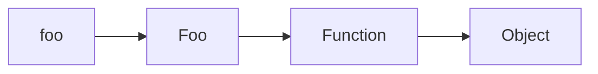

# Dead Code Detection on Strict ECMAScript 6 Projects
## Alberto Martínez de Murga Ramírez
### Supervisor: Vadim Zaytsev

<!--
My name is Alberto Martinez de Murga Ramirez. My research has been based around
dead code detection in ECMAScript 6 projects. I started this research on 2017
as part time single student when I was working on a small startup here. 4 years
later, I changed jobs twice, got married, moved houses technically 2 times and
lived in France briefly.

The problem of dead code in JavaScript is still relevant and I hope to make a
different about it today.
-->

---
layout: fact
---
# What is dead code?

<br />

> ## Dead code is code which is never used or reachable. It is not harmful by itself since it does nothing but it is considered a “bad smell” in the code.
> ## A “bad smell” is a symptom of bad implementation or design that corresponds to a deeper problem in the system.

<!--
- Very common issue in all langauges. It affects around 30% of the codebase. Two
main reasons: YAGNI and software evolution
- Web applications are one of the most common software program.
- Lehman's classification type E (embeded in the world). They are constantly
  evolving and change very fast
- Frontend can be only written in JavaScript. JavaScript evolves very fast. Also
    its libraries. React has major versions since 2013.
- Fast evolution implies dead code.
- We aim to create a tool that detects this type of code.
-->
---
layout: two-cols
---

# Academy
- Not many initiatives in this area.
- Combination of static and dynamic analysis.
- Targets ECMAScript 5
- _JSNOSE, Lacuna_

::right::

# Industry
- Tools created for developers without academic research behind.
- Mostly static analysis.
- _ESLint_: Linter. Syntactic analysis, not semantic.
- _Rollup, webpack_: Transpilers. Three-shaking
<style>
ul { padding-top: 2.5em; li { font-size: 1.5em; } }
em { color: teal; }

</style>

<!--
- JavaScript is the language, ECMAScript is the specification of the language
- JNOSE: combination of metrics and thresholds.
- Lacuna: Combination of flow graphs and call graphs.
- Eslint looks for patterns in the code that tell bad smells.
- Rollup and webpack: They apply convertions to codebases. One of
  them is three-shaking: drops files and fragments of code during minification.
-->

---
layout: statement
---
# What is JavaScript

> ## Small glue language easy to use by designers and part-time programmers to assemble components like images
## Curly-bracket syntax, dynamic, prototye based, first class functions
## Chaotic development
## Multiparadigm

<style>
h2 { padding: 0.5em; }
blockquote { padding: 1.5em; }
</style>
<!--
- Originally designed in Netscape as
- Like C, Java, dynamic types and everything in general.
- Created in  1995 but until 2009 wasn't unified. ES6 2015.
- It is also used in server side (Node.js, Netscape Enterprise Server, deno),
databases (MongoDB, DynamoDB), videogames (UnityScript, ActionScript),
operative systems (JavaScript for Autommation, WinJS) and phone programming
(React Native, Cordova, KaiOS).
-->

---
layout: image-left
image: /js-trinity.png
---
# JavaScript as a language
## Loosely typed
- 7 different types: `String`, `Number`, `Boolean`, `Symbol`,`null`,
    `undefined` and `Object`.
- Everything else which is not in the list _inherits_ from `Object`.
- Automatic conversion between types.

<br />

```js{all|1|2|3,4}
1 + "1" // "11"
1 - "1" // 0
!0+[] // true
!0+[]+![] // 1
```
<!--
- Everything but object are primitives
- Function and Array also inherit from object.
- In the example we can see how type convertion can be a bit confusing
    sometimes. For instance, in the first case, we can see how both are
    transformed into string, but in the second there are both to number.
- Some of them are little intuitive.
-->
---
layout: two-cols
---
## Prototype based

<br />

- The properties of an object are defined dynamically and recursively.
- Every object a prototype, which is another object.
- Resolution of properties happens recursively.

<br />

```js
const foo = new Bar()
```

<br /><br />



::right::

## Functions as first class citizens

<br />

Heavy usage of callbacks, anonymous functions, function composition, scope binding...

<br />

```js
const myButton = document.getElementById('my-button')
myButton.addEventListener('click', function() {
    alert('You clicked me!')
}, false)
````

<style>
.shiki-container { padding-right: 1em; }
</style>
<!--
- Until we reach the original Object type we saw before.
- If at the end of the recursion the property is not resolved, it is created
    with the value undefied.
- Changing the properties of an object during runtime changes the properties of
all the objects in the chain.

- Very much used in events and asynchronous code. In the example we can see how
    we have declared an anonymous function, which normally is an stametement,
    as an expression part of a function call in an event handler.
-->
---
layout: default
---
## Dynamic

<logos-twitter />

> **[Jake Archibald](https://twitter.com/jaffathecake/status/1427915254848270337)**
>
> Here's a fun JS example. The function is hoisted to an identifier scoped
> within the block, but in non-strict mode it also assigns the function to `a`
> in the parent scope.

<br />

```js{all|1,2,11|3-10|6|4,8,9|11}
var a = 'foo';
console.log(a); // "foo"
{
    console.log(a); // function a()

    function a() {}

    a = 'bar';
    console.log(a); // "bar"
}
console.log(a); // function a();
```
<!--
- Very much asynchronous and event oriented language. The execution order is
    altered by the usage of the callbacks, hoisting and events.

- Jake Archibald, developer advoce working on Chrome.
- Here we can see how properties can change during runtime. Normally, code is
    execute from top to bottom in the global scope, which is similar to a
    function scope. The execution starts and we declare a variable a with the
    value foo. In the next line, we can confirm this. Then we get into the
    block. We see that the value has changed on line 4 because the definition in
    line 6 is hoisted (this is, moved to the top). This also overwrites the
    value of the variable and turns it into a function. Later on, we turn it
    again in a variable. However, when we leave the block the value turns again
    into a function. This is because the function definition "survives" the
    block scope. If it wasn't a function, just 'bar', the value in the last line
    would have been foo.
-->
---
layout: section
---
# Aproach
## Targeting ECMAScript 6
- Most _modern baseline_.
## Static analysis
- Works on different environments.
- Does not require on user interaction.
- It only needs the source code so it can be integrated.
## Call-graph based
- Proven approach for dead code detection.


<style>
ul { list-style: none; }
</style>

<!--
- We assume and ES6 program that runs without errors in the target platform and
    follows best practices.
- ES5 is the minimum version shared by all the browsers as it was the first
    "common" spec. ES6 has been to the date the biggest version in regards of
    features that has ever been. It includes things like block scopes, modules,
    import/export and classes. Most of literature cover only ES5.
- Dynamic analysis requires also data gathering. This implies running during a
    certain period of time additional code to gather metrics. If the time is not
    big enough, "necessary" paths might be excluded because were never called
    (ie. delete an account, compliance features)
- We choose call graphs because it is a proven solution in other languages for
    dead code detection and for static analysis in general.

-->
---
layout: two-cols
---

# Call graph construction
## Existing solutions

### From academy
- TAJS
- SAFE
- JSAI
### From industry
- WALA
- Eslint
- rollup & webpack

::right::

## Our approach
Hybrid of a call-graph and a flow graph.
### Statement node
> node of the callgraph which matches a ECMAScript statement of the file's AST.
### Terminal node
> Statement node that represents an interaction with the "outside world".
### Relationship edge
> Edge of the call graph that describes a relationship between two statement
> nodes.
>
>`call`, `return`, `read`, `write`, `arg`, `param`, `import`,`export`

**For every file:**

1. Extract the AST of the file.
2. Create a node per AST Statement.
3. Link `read-write`, `call-return`, `arguments-parameters`, `import-export`

<!--
- Research about the existing tools show that they have but often they
  have false positives and not able to analyse up-to-date multi-file Node.js
  modules due to incomplete language features support. Also, to my knowledge,
  they don't work with ES6.

- WALA: IBM TJ Watson Center. Set of tools for Java mostly and some JavaScript.
    It is able to create call graphs but only after normalising the code. That
    makes it useless for us.
- ESLint: does not use call graphs but looks for certain patterns.
- rollup & webpack use internally call graphs but they don't expose it. They
    work with functions and modules which is not enough for us as we aim for
    statements.
- flow graph: flow of information. call graph: flow of function calls.
- A statement node represent a line of code or equivalent
  in the file.
- This can be a user interaction, writing a file in the file system, making a
  HTTP request, being exported for consumption, etc. These interactions might
  have unknown repercussions that we might no be aware by just performing
  static analysing the code.
-->

---
layound: default
---
# A simple call graph

```js
const foo = 'foo'

function bar(baz) {
  console.log(baz)
}

bar(foo)
```

<arrow x1="500" x2="500" y1="200" y2="300" color="gray"/>
<br />
<br />


<!--
Here we can see an example of a snippet turned into a call graph. The first line
declares a variable in the bottom left of the graph. This one is read and used
as parameter in the function call of the line 7 (top node). This function calls
the function declared in line 3 which prints the value used as a paramter. All
the nodes are linked hence there is no dead code.
-->
---
layout: default
---
# Challenges of static analysis & call-graphs

<br />
<div class="grid grid-cols-3 grid-gap-10">
<div class="green">

- Asynchronous code
- Webassembly
- Hoisting
- Imports and exports of modules

</div>
<div class="yellow">

- Entry point of the program
- Functions as parameters

</div>
<div class="red">

- Determine the version of JavaScript
- Object property analysis
- Redefinition of variables

</div>
</div>

<style>
li { font-size: 1.5em; line-hegiht: 1.2em; }
.green { color: darkgreen; }
.yellow { color: yellow; }
.red { color: darkred; }
</style>
<!--
- Imports and export: Big win, because it is a complex topic due to
    incompatibilities and not support in general.

- There are two which are incompatible by default but they
    can be made compatible with little effort.  We assume that the compatibility
    issue is solved as it runs. Our approach takes the project as a whole so it
    is able to link the imports and exports between different files.


- Entry point of the program: Explicitly declared in the configuration.
- Determine the version: There is no way of determine which browser/engine runs
    which version, and which features are implemented. MDN, caniuse.com. This is
    painful.

- The object properties is one of our biggest limitations. It is not only the
    dinamism but the granularity and the functions as properties.
- The object properties are dynamic and can be adeded, modified or removed on
    execution time (the value and the property). They can contain functions too,
    turning them in sort of a calass. They are at expressions level, which our
    granularity of analysis does not cover. Because of the additional contraints
    on class properties (use this) we can support them.

-->
---
layout: default
---
# Dead code detection

> Having a list with all the nodes of a program and a call graph, dead code are
> those statements of the list of nodes which are not in the call-graph.

<br />

- Once we have a project call-graph, it uses a breath first search algorithm for each entry point.

- We have a sub-graph for every entry point of the program.
- Isolated nodes and subgraphs without at least a terminal node are considered dead.

<br />

<div class="grid grid-cols-2 grid-gap-4">
<div>

## Types of dead code

- Dead dependencies.
- Dead modules.
- Dead statements.

</div>
<div>

## Grades of dead code

- Dead code
- Contextually dead code
- _Alive_ code

</div>
</div>

<!--
- Simple approach used in other languages.
- Depends heavily on the quality of the call graph.
- Dependencies: external libraries defined in the package.json.
- Modules: source files.
- Statements: lines of code.
-->
---
layout: full
---

[](https://asciinema.org/a/431877)

---
layout: default
---
# Experimental results
- Implemented a proof of concept and ran it (https://github.com/threkk/prune.js)
- Run it against three projects:
    - small web frontend application: Built ad-hoc. It contains faults. (https://github.com/threkk/dead-code-example/)
    - **`chalk`**: Node.js library. 16.7 thousands stars on GitHub. 72,066 projects
    depending on it. 97,897,218 downloads per week. Last major release May 2021.
    - **`debug`**: Isomorphic library. 9.7 thousands stars on GitHub. 11,752,159 projects
    depending on it. 113,822,157 downloads per week. Last major release December 2020.

- Expected results, but with false positives.
<!--
- The proof of concept uses Espree. It does not cover grade detection.
- Minimum call graph implementation.
- swa: detected the introduced faults. Can be fixed.
- chalk: No errors.
- debug: false positives. Can be explained.
- We can make a go through later on.
-->

---
layout: quote
---
# Conclusions

<div class="positive">

- Developed a method that locates potential dead code in ES6 projects.

- Fresh implementation of a call-graph.

</div>

<div class="negative">

- Accuracy of the algorithm depends on the quality of the call-graph. More
    relations, better results

- Language challenges are difficult to overcome.

</div>

## Questions?

<style>
.positive { ul { list-style: "+  "; } }
.negative { ul { list-style: "-  "; } }
</style>
<!--
- This method work in more modern versions than academic with only staic
    analysis and reports results that industry cannot by using a single method.
- We also create a fresh call graph implementation as existing ones do not
    support ES6 neither multiple files. This could have been by itself the whole
    thesis.

- There is a reason why target only ES5 with a hybrid approach.
- ES6 includes a lot of new features.
- Not possible to detect the right version neither properly treat objects.
- Proof of concept for small real projects "work", but when they grow and add
more casuistic,
-->

---
layout: section
---

# Fin

---
layout: section
---

# Annex

---
layout: quote
---
# History of JavaScript: the chaos
- **1995:** Created by Brendan Eich as part of the version 2.0 of Netscape.
- **1996:** Netscape submitted the JavaScript specification to the _European Computer Manufacturers Associations_ (ECMA).
- **1997:** Release of ECMAScript version 1.
- **1998:** ECMAScript version 2.
- **1999:** ECMAScript version 3.

<style>
ul { padding-top: 2.5em; li { font-size: 1.5em; } }
strong { background-color: teal; }
</style>

<!--
- Brendan Eich will become CEO of Mozilla and Brave
- Submitted with the intention that other browsers could implement the JavaScript language
- Only run on Netscape, but Microsoft reverse engineered its own scripting technologies for the browser Internet Explorer, named VBScript and JScript.
- Originally, Microsoft had no intention of implementing JavaScript on Internet Explorer.
- This was a big problem for developers trying to support all the browsers.
- _Best viwed in..._
-->
---
layout: quote
---
# History of JavaScript: the drama
- **2003:** ECMAScript 4 started to be developed, with participants very divided.
- **2008:** Both sides meet in Oslo and reach an agreement. ECMAScript 4 was never completed, but a subset of it was released as ECMAScript 3.1
- **2009:** ECMAScript 5 gets released. Common base for JavaScript.
- **2010:** ECMAScript 5.1 gets released to align with _ISO/IEC 16262_.
- **2015:** ECMAScript 6. Most improvements ever released.

<style>
ul { padding-top: 2.5em; li { font-size: 1.5em; } }
strong { background-color: teal; }
</style>

<!--
- There were two sides:  Adobe, Mozilla and Macromedia vs Microsoft, Yahoo and Google.
- Issues about how ambitious the changes should be and the possible backwards compatibility issues.
- They agreed on collaborating in the development of ECMAScript 5.
- ISO specification for JavaScript.
- Since then, one new version every year:  v7 (2016), v8 (2017)...
-->
