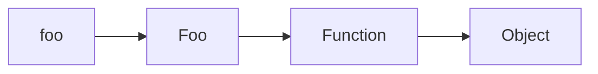

# Dead Code Detection on Strict ECMAScript 6 Projects
## Alberto Martínez de Murga Ramírez
### Supervisor: Vadim Zaytsev

<!--
My name is Alberto Martinez de Murga Ramirez. My research has been based around
dead code detection in ECMAScript 6 projects. I started this research on 2017
as part time single student when I was working on a small startup here. 4 years
later, I changed jobs twice, got married, moved houses technically 2 times and
lived in France briefly.

The problem of dead code in JavaScript is still relevant and I hope to make a
different about it today.
-->

---
layout: fact
---
# What is dead code?

<br />

> ## Dead code is code which is never used or reachable. It is not harmful by itself since it does nothing but it is considered a “bad smell” in the code.
> ## A “bad smell” is a symptom of bad implementation or design that corresponds to a deeper problem in the system.

<!--
- Very common issue in all langauges.
- If affect around 30% of the codebase.
- Two main reasons: YAGNI and software evolution
- Web applications are one of the most common software program.
- They are constantly evolving and change very fast
- Lehman's classification type E
    - S - Specification, formally defined
    - P - Problem, may be formulated but approximated.
    - E - Embedded in the real world.
- Frontend can be only written in JavaScript. JavaScript evolves very fast.
- React has major versions since 2003.
- Fast evolution implies dead code.
- We aim to create a tool that detects this type of code.
-->
---
layout: two-cols
---

# Academy
- Not many initiatives in this area.
- Combination of static and dynamic analysis.
- Targets ECMAScript 5
- _JSNOSE, Lacuna_

::right::

# Industry
- Tools created for developers without academic research behind.
- Mostly static analysis.
- _ESLint_: Linter. Syntactic analysis, not semantic.
- _Rollup, webpack_: Transpilers. Three-shaking
<style>
ul { padding-top: 2.5em; li { font-size: 1.5em; } }
em { color: teal; }

</style>

<!--
- JavaScript is the language, ECMAScript is the specification of the language
- JNOSE: combination of metrics and thresholds.
- Lacuna: Combination of flow graphs and call graphs.
- Three-shaking: drops files and fragments of code during minification.
-->

---
layout: statement
---
# What is JavaScript

> ## Small glue language easy to use by designers and part-time programmers to assemble components like images
## Curly-bracket syntax, dynamic, prototye based, first class functions
## Multiparadigm

<style>
h2 { padding: 0.5em; }
blockquote { padding: 1.5em; }
</style>
<!--
- Like C, Java
- Dynamic types and everything in general.
- There have been implementations server side. Netscape introduced an implementation of the language into Netscape Enterprise server (1995) and Microsoft supported JSCript in ASP an .NET (1996). In 2009 Nodejs was released using the JavaScript engine V8 of Google Chrome browser.
- It is also used in databases (MongoDB, DynamoDB), videogames (UnityScript), operative systems (JavaScript for Autommation, WinJS) and phone programming (React Native, Cordova, KaiOS).
-->
---
layout: quote
---
# History of JavaScript: first versions
- **1995:** Created by Brendan Eich as part of the version 2.0 of Netscape.
- **1996:** Netscape submitted the JavaScript specification to the _European Computer Manufacturers Associations_ (ECMA).
- **1997:** Release of ECMAScript version 1.
- **1998:** ECMAScript version 2.
- **1999:** ECMAScript version 3.

<style>
ul { padding-top: 2.5em; li { font-size: 1.5em; } }
strong { background-color: teal; }
</style>

<!--
- Brendan Eich will become CEO of Mozilla and Brave
- Submitted with the intention that other browsers could implement the JavaScript language
- Only run on Netscape, but Microsoft reverse engineered its own scripting technologies for the browser Internet Explorer, named VBScript and JScript.
- Originally, Microsoft had no intention of implementing JavaScript on Internet Explorer.
- This was a big problem for developers trying to support all the browsers.
- _Best viwed in..._
-->
---
layout: quote
---
# History of JavaScript: the drama
- **2003:** ECMAScript 4 started to be developed, with participants very divided.
- **2008:** Both sides meet in Oslo and reach an agreement. ECMAScript 4 was never completed, but a subset of it was released as ECMAScript 3.1
- **2009:** ECMAScript 5 gets released. Common base for JavaScript.
- **2010:** ECMAScript 5.1 gets released to align with _ISO/IEC 16262_.
- **2015:** ECMAScript 6. Most improvements ever released.

<style>
ul { padding-top: 2.5em; li { font-size: 1.5em; } }
strong { background-color: teal; }
</style>

<!--
- There were two sides:  Adobe, Mozilla and Macromedia vs Microsoft, Yahoo and Google.
- Issues about how ambitious the changes should be and the possible backwards compatibility issues.
- They agreed on collaborating in the development of ECMAScript 5.
- ISO specification for JavaScript.
- Since then, one new version every year:  v7 (2016), v8 (2017)...
-->
---
layout: image-left
image: /js-trinity.png
---
# JavaScript as a language
## Loosely typed
- 7 different types: `String`, `Number`, `Boolean`, `Object`, `Symbol`,`null`,
    `undefined`.
- Everything else which is not in the list _inherits_ from `Object`.
- Automatic conversion between types.

<br />

```js{all|1|2|3,4}
1 + "1" // "11"
1 - "1" // 0
!+[] // true
!+[]+![] // 1
```
<!--
- Everything but object are primitives
- Function and Array also inherit from object.
-->
---
layout: two-cols
---
## Prototype based

<br />

- Dynamic definition of the properties of an object.
- Every object a prototype, which is another object.
- Resolution of properties happens recursively.

<br />

```js
const foo = new Bar()
```

<br /><br />



::right::

## Functions as first class citizens

<br />

Heavy usage of callbacks, anonymous functions, function composition...

<br />

```js
const myButton = document.getElementById('my-button')
myButton.addEventListener('click', function() {
    alert('You clicked me!')
}, false)
````

<style>
.shiki-container { padding-right: 1em; }
</style>
<!--
- Changing the properties of an object during runtime changes the properties of
all the objects in the chain.

- Very much used in events and asynchronous.
-->
---
layout: default
---
## Dynamic

<br />

- Very much asynchronous and event oriented language.
- The execution order is altered by the usage of the callbacks, hoisting and
    events.

- Properties can change during runtime.
- Non-existing properties in objects will be created during runtime.

<logos-twitter />

> **[Jake Archibald](https://twitter.com/jaffathecake/status/1427915254848270337)**
>
> Here's a fun JS example. The function is hoisted to an identifier scoped
> within the block, but in non-strict mode it also assigns the function to `a`
> in the parent scope.

<br />

```js{all|1,2,11|3-10|6|4,8,9|11}
var a = 'foo';
console.log(a); // "foo"
{
    console.log(a); // function a()

    function a() {}

    a = 'bar';
    console.log(a); // "bar"
}
console.log(a); // function a();
```

<!--
- Jake Archibald, developer advoce working on Chrome.
- Now we have syntactic sugar like promises and async/await to abstract the
    callback hell.
- We are not getting into chaging the scope of execution using bind/call
- The semicolon is optional
-->
---
layout: section
---
# Aproach
## Targeting ECMAScript 6
- Most _modern baseline_.
## Static analysis
- Works on different environments.
- Does not require on user interaction.
- It only needs the source code so it can be integrated.
## Call-graph based
- Proven approach for dead code detection.


<style>
ul { list-style: none; }
</style>

<!--
- We assume and ES6 program that runs without errors in the target platform and
    follows best practices.
- ES5 is the minimum version shared by all the browsers as it was the first
    "common" spec. ES6 has been to the date the biggest version in regards of
    features that has ever been. It includes things like block scopes,
    import/export and classes. Most of literature cover only ES5.
- Dynamic analysis requires also data gathering. This implies running during a
    certain period of time additional code to gather metrics. If the time is not
    big enough, "necessary" paths might be excluded because were never called
    (ie. delete an account, compliance features)
- We will talk about call graphs in future slides.
-->
---
layout: two-cols
---

# Call graph construction
## Existing solutions
_Estree: Esprima/Acorn/Espree_
### From academy
- TAJS
- SAFE
- JSAI
### From industry
- WALA
- Eslint
- rollup & webpack

::right::

## Our approach
Hybrid of a call-graph and a flow graph.
### Statement node
> node of the callgraph which matches a ECMAScript statement of the file's AST.
### Terminal node
> Statement node that represents an interaction with the "outside world".
### Relationship edge
> Edge of the call graph that describes a relationship between two statement
> nodes.
>
>`call`, `return`, `read`, `write`, `arg`, `param`, `import`,`export`

**For every file:**

1. Extract the AST of the file.
2. Create a node per AST Statement.
3. Link `read-write`, `call-return`, `arguments-parameters`, `import-export`

<!--
- ESTree created by David Herman while documenting the API exposed by
  spidermonkey. Esprima, created by the jQuery foundation, 1st parser. Acorn
  by Marijn Haverbeke, faster, smaller, more extensible. Esprima, fork of
  ESLint because Espree didn't update. Later on, swap the core wiht Acorn.

- Research about the existing tools show that they have but often they
  have false positives and only two of them are able to analyse up-to-date
  multi-file Node.js modules due to incomplete language features support. Also, ES5.

- WALA: IBM TJ Watson Center. Set of tools for Java and JAvaScript. Able to do
  normalisation to analyse and create intra procedural graphs.
- ESLint: linter based on Espree, file based able to detect variables and
  function dead code among other smells based on syntactic analysis (not
  semantic).
- rollup & webpack are transpiler. During the three-shaking process of
  minification they are able to drop unused functions and modules.

- flow graph: flow of information. call graph: flow of function calls.
- The ECMAScript program is composed of statements, and each
  statement is a node. A statement node represent a line of code or equivalent
  in the file. A line of code is series of words that are accepted for the
  parser and limited by a semicolon or a new line.
- This can be a user interaction, writing a file in the file system, making a
  HTTP request, being exported for consumption, etc.
- These interactions might have unknown repercussions that we might no be aware
  by just performing static analysing the code.

-->
---
layound: default
---
# A simple call graph

```js
const foo = 'foo'

function bar(baz) {
  console.log(baz)
}

bar(foo)
```

<arrow x1="500" x2="500" y1="200" y2="300" color="gray"/>
<br />
<br />


---
layout: default
---
# Challenges of static analysis & call-graphs

<br />
<div class="grid grid-cols-3 grid-gap-10">
<div class="green">

- Asynchronous code
- Webassembly
- Hoisting
- Imports and exports of modules

</div>
<div class="yellow">

- Entry point of the program
- Functions as parameters

</div>
<div class="red">

- Determine the version of JavaScript
- Object property analysis
- Redefinition of variables

</div>
</div>

<style>
li { font-size: 1.5em; line-hegiht: 1.2em; }
.green { color: darkgreen; }
.yellow { color: yellow; }
.red { color: darkred; }
</style>
<!--
- asynchronous code: Not a problem as it does not affect our approach building
    call graphs.
- webassembly: treated as a library
- hoisting: does not affect us, we only care the read and write, not the value.
- Imports and export: There are two which are incompatible by default but they
    can be made compatible with little effort.  We assume that the compatibility
    issue is solved as it runs. Our approach takes the project as a whole so it
    is able to link the imports and exports between different files.


- Entry point of the program: Explicitly declared in the configuration.
- Function as parameters: We treat the call as a read. If it is anoynmous, we
    treat it also as a declaration by adding syntetic nodes or attaching it to
    the parent. Hurts when it is an expression.
- Determine the version: There is no way of determine which browser/engine runs
    which version, and which features are implemented. MDN, caniuse.com


- The object properties are dynamic and can be adeded, modified or removed on
    execution time (the value and the property). They are at expressions level, which our granularity of
    analysis does not cover. Because of the additional contraints on class
    properties (use this) we can support them.

-->
---
layout: default
---
# Dead code detection

> Having a list with all the nodes of a program and a call graph, dead code are
> those statements of the list of nodes which are not in the call-graph.

<br />

- Uses a breath first search algorithm for graphs.

- We have a sub-graph for every entry point of the program.
- Isolated nodes and subgraphs without at least a terminal node are considered dead.

<br />

<div class="grid grid-cols-2 grid-gap-4">
<div>

## Types of dead code

- Dead dependencies.
- Dead modules.
- Dead statements.

</div>
<div>

## Grades of dead code

- Alive code
- Contextually dead code
- Dead code

</div>
</div>

<!--
- Simple approach used in other languages.
- Depends heavily on the quality of the call graph.
-->
---
layout: full
---

[](https://asciinema.org/a/431877)

---
# Experimental results
<!-- Results -->
<!-- Project analysed, results -->

---
# Conclusions
<!-- Conclusions -->
